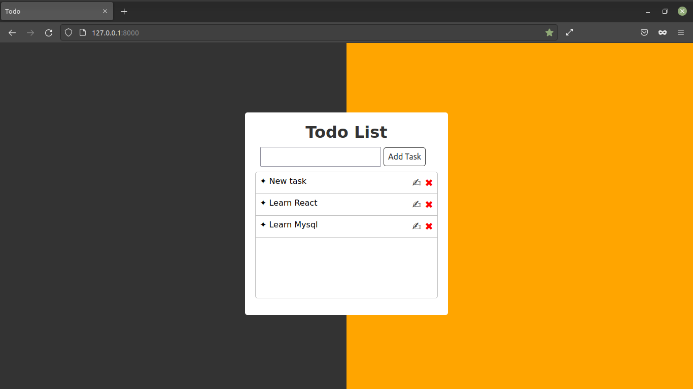

# Todo list app using function based views

### Note:
#### To run this djago project without any errors you need to create and activate virtual environment and Install django in it. 
#
### Superuser
- Username ```admin```
- Password ```admin```  

---





---
## Windows


- Clone this repository using  => git clone [repository link] or download and extract zip file
```
git clone (link)
```

- Navigate to this repository using command line
```
cd (repo name)
```

- Crete virtual environment => py -m venv [virtual environment name]
```
py -m venv env
```
 - Activate virtual environment
 ```
 env\Scripts\activate.bat
 ```

 - Install requirements 
 ```
 pip install -r requirements.txt
 ```
 - Run Server
 ```
  py manage.py runserver
 ```

 ## Linux / Mac


- Clone this repository using  => git clone [repository link] or download and extract zip file
```
git clone (link)
```

- Navigate to this repository using command line
```
cd (repo name)
```

- Crete virtual environment => python3 -m venv [virtual environment name]
```
python3 -m venv env
``` 
 - Activate virtual environment 
 ```
  source env/bin/activate
  ```

 - Install requirements
 ```
 pip install -r requirements.txt
 ```
- Run Server
 ```
  python3 manage.py runserver
 ```


 ##### Note: If any errors occured Google that issue. 
